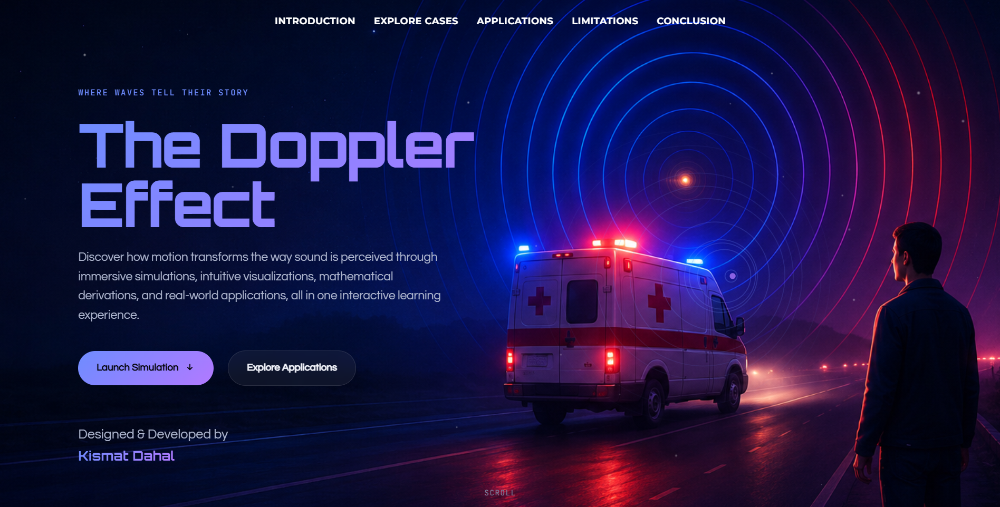
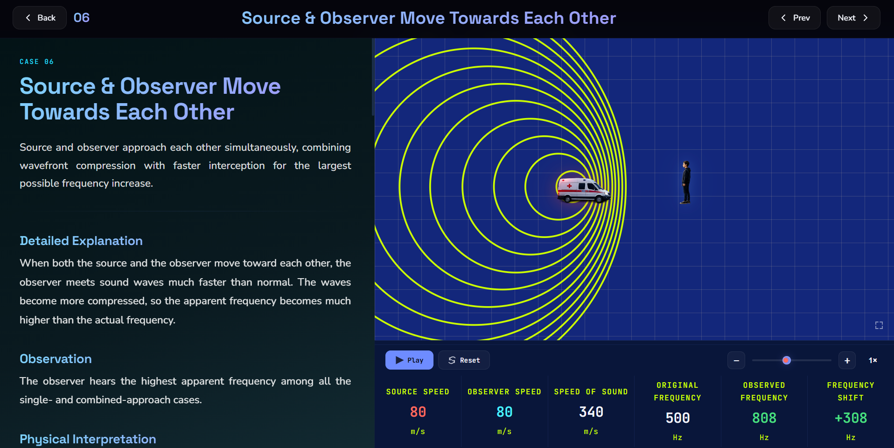
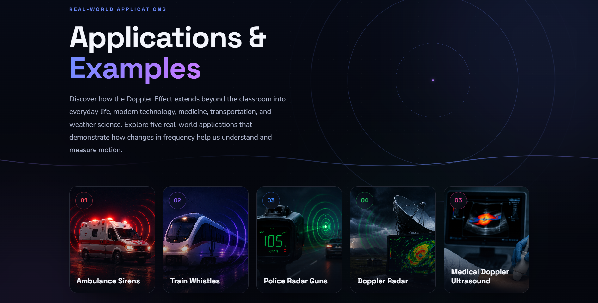
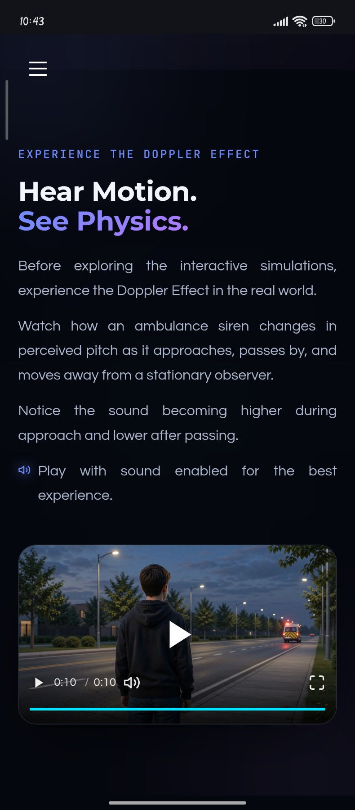
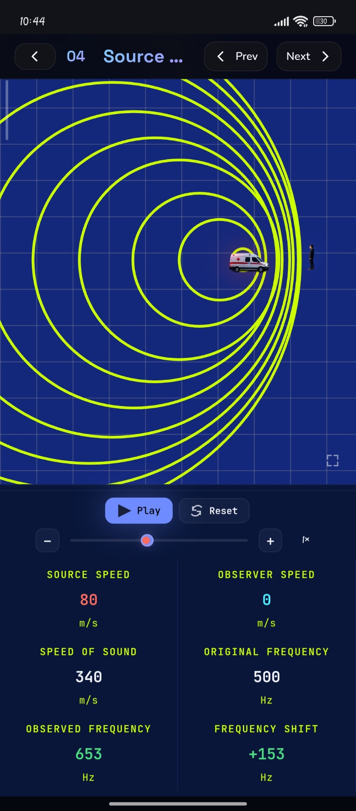
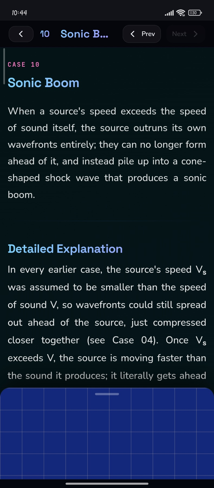
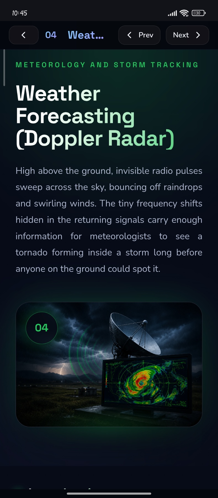

# 🌊 Doppler Effect Interactive Learning Platform

### Visualizing Motion. Understanding Sound.

An interactive educational web application that transforms the Doppler Effect into an engaging visual learning experience through interactive simulations, animations, and real-world examples.

 

---

## 📸 Project Preview

### 🖥️ Desktop Experience

<table align="center">
  <tr>
    <td align="center">
       
      <b>🏠 Hero</b>
    </td>
    <td align="center">
       
      <b>🎮 Simulation</b>
    </td>
    <td align="center">
       
      <b>🚑 Application</b>
    </td>
  </tr>
</table>

 

### 📱 Mobile Experience

<table align="center">
  <tr>
    <td align="center">
       
      <b>🎬 Video</b>
    </td>
    <td align="center">
       
      <b>📚 Cases</b>
    </td>
    <td align="center">
       
      <b>🎮 Simulation</b>
    </td>
    <td align="center">
       
      <b>📖 Detail Page</b>
    </td>
  </tr>
</table>

 

---

## 📖 About the Project

The Doppler Effect Interactive Learning Platform helps learners understand the physics of sound and motion through **visual learning** instead of static equations. Rather than memorizing formulas, users explore **interactive simulations** that respond in real time, paired with **real-world examples** like ambulances, trains, and moving vehicles. Wrapped in a **modern interface**, the platform turns an abstract physics concept into something you can see, hear, and manipulate — building **intuitive understanding** through experimentation rather than repetition.

 

---

## ✨ Features

- ✅ 10 Interactive Cases
- ✅ Physics Simulations
- ✅ Animated Wave Visualization
- ✅ Educational Video
- ✅ Real-world Examples
- ✅ Mathematical Model
- ✅ Smooth Navigation
- ✅ Responsive Design
- ✅ Modern Glassmorphism UI
- ✅ Interactive Learning Experience

 

---

## 🎯 Interactive Cases

|  #  | Case                                           |
| :-: | :--------------------------------------------- |
| 01  | Stationary Source & Stationary Observer        |
| 02  | Moving Source & Stationary Observer            |
| 03  | Stationary Source & Moving Observer            |
| 04  | Source Approaching Observer                    |
| 05  | Source Receding from Observer                  |
| 06  | Observer Approaching Source                    |
| 07  | Observer Receding from Source                  |
| 08  | Source & Observer Moving Toward Each Other     |
| 09  | Observer Following the Source                  |
| 10  | Source & Observer Moving in the Same Direction |

 

---

## 🧮 Mathematical Model

| Symbol | Meaning             |
| :----: | :------------------ |
|  `f`   | Emitted frequency   |
|  `f'`  | Observed frequency  |
|  `v`   | Speed of sound      |
|  `vo`  | Observer's velocity |
|  `vs`  | Source's velocity   |

 

---

## 🛠️ Tech Stack

 

---

## 🚀 Live Demo

🌐 **Website:** [https://dopplereffect.vercel.app)

 

---

## 👤 Author

**Kismat Dahal**

Frontend Development Enthusiast · Physics Learning Enthusiast

>)

 

---

⭐ **If you found this project interesting, consider giving it a star.**

Thank you for visiting this project.

